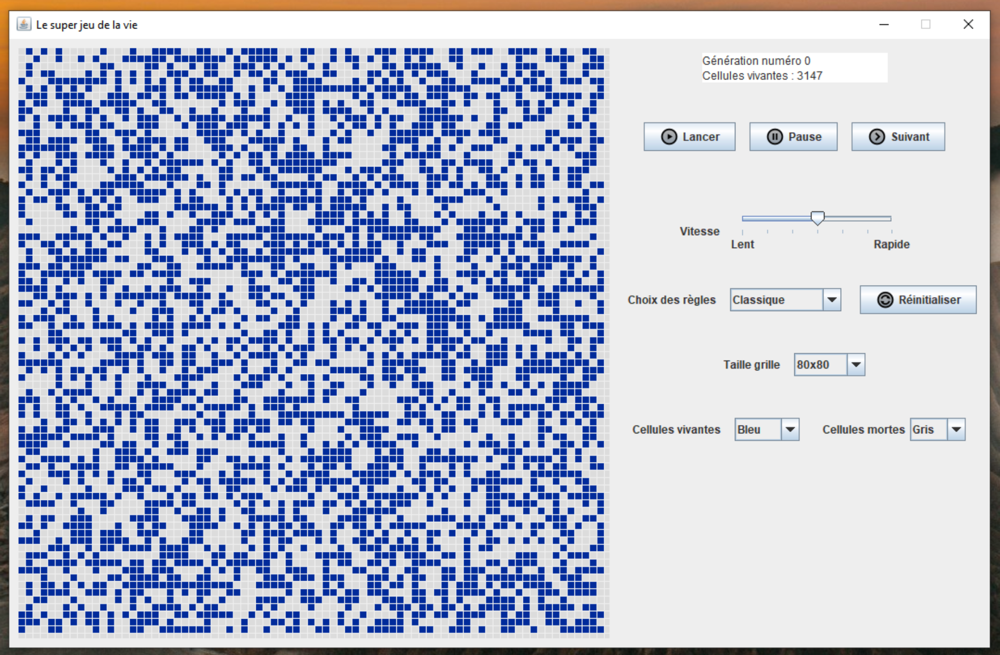
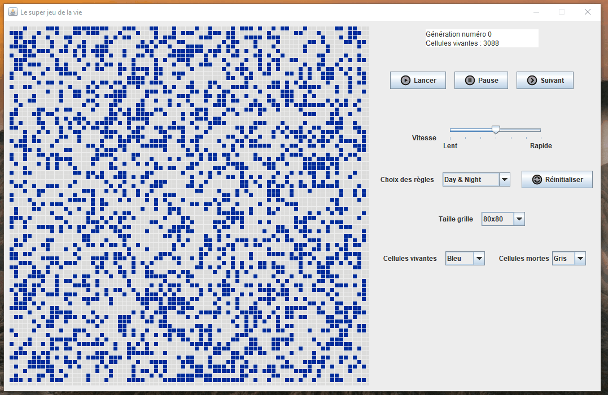

## Jeu de la vie (*Game of Life*)
Projet réalisé dans le cadre du module "Design Pattern" de la 3ème année de Licence Informatique (Le Mans Université). 

### Objectifs :

* Implémenter le principe du "Jeu de la vie" (aussi appelé "Automate Cellulaire")
* Implémenter le jeu selon 5 Design Patterns :
  * Etat (*State*)
  * Singleton
  * Observateur (*Observer*)
  * Commande (*Command*)
  * Visiteur (*Visitor*)

### Technologies utilisées :
* Java,
* Swing pour l'interface graphique.

### Principe :

Un automate cellulaire est un objet mathématique qui permet de simuler l’évolution d’une population de
cellules virtuelles au cours du temps, selon des règles de voisinage (règles classiques mais il existe des règles alternatives) :
* Si une cellule possède moins de 2 voisines, elle meurt;
* Si une cellule possède plus de 3 voisines, elle meurt aussi;
* Si un emplacement vide (ou cellule morte) possède 3 voisines (vivantes), une nouvelle cellule naît.

### Fonctionnalités implémentées :
* Affichage textuel de la génération en cours et du nombre de cellules vivantes ;
* Boutons pour l’exécution et l’arrêt de la boucle de génération du jeu ;
* Bouton pour avancer « pas à pas » ou de « génération en génération » ;
* Ajustement de la vitesse de génération avec un slider (accélérer ou ralentir) ;
* Possibilité de changer les règles à appliquer ;
* Possibilité de voir le comportement d’un canon (structure qui émet des « vaisseaux » à
intervalles réguliers) ;
* Possibilité de réinitialiser la grille ;
* Changement de la taille de la grille : 5 tailles possibles ;
* Possibilité de personnaliser les couleurs des cellules vivantes et mortes.

### Démonstration :

### Lancement de l'application :
Pour lancer l’application, il suffit d’exécuter en double-cliquant sur le fichier :
 ``Le_super_jeu_de_la_vie.jar``
 
 Si cela ne fonctionne pas, ouvrir un terminal et taper la commande :
 ``java -jar Le_super_jeu_de_la_vie.jar``

